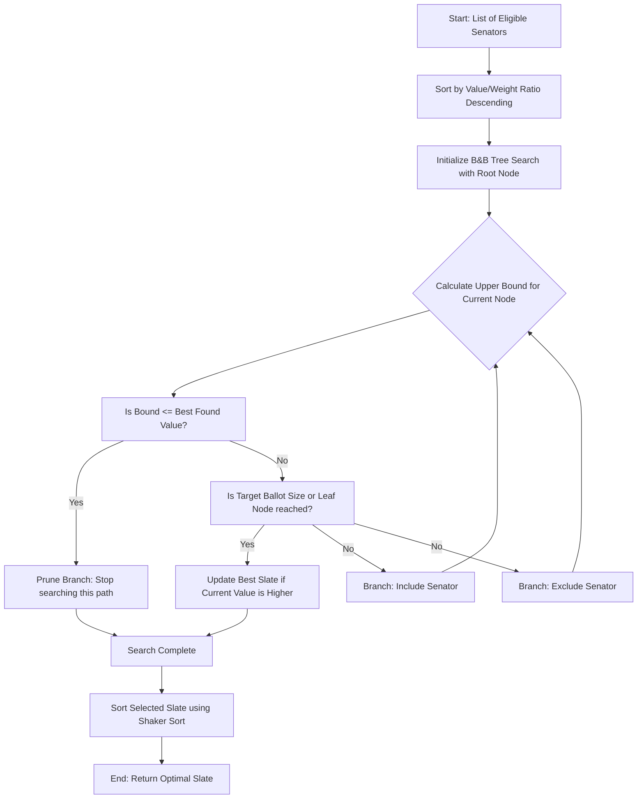

# Optivote-PH: Algorithm & Backend Engine Explanation

This document provides a detailed walkthrough of the core logic, backend computations, data modeling, and algorithms powering the **Optivote-PH** mobile prototype. 

Optivote-PH is designed to help voters optimize their senatorial ballot choices by prioritizing candidates based on historical legislative performance. It allows users to select priority sectors (committee areas), dynamically modifies candidate values, and solves a constrained mathematical optimization problem using a custom Branch and Bound implementation.

---

## 1. Data Architecture & Candidate Data Model

The application stores legislative records in a local CSV file located at `assets/senators_bill.csv`. When the application initializes, the data is parsed and mapped into memory.

### Senator Data Structure
Defined in [optimizer_engine.dart](file:///c:/Users/lenovo/StudioProjects/optivote_ph_mobile_prototype/lib/optimizer_engine.dart), each candidate is represented by the `Senator` class:

```dart
class Senator {
  final String name;
  final String party;
  final int authored;
  final int passed;
  double v; // Dynamic Productivity Value
  final double w; // Inefficiency Weight
  final Map<String, int> sectorPassed;
  
  // ... constructor ...
}
```

### Metrics Definition & Calculations
During parsing in [main.dart](file:///c:/Users/lenovo/StudioProjects/optivote_ph_mobile_prototype/lib/main.dart), raw bill counts are used to calculate the following metrics:

1. **Bills Authored (`authored`)**: The total number of bills sponsored/authored by the senator.
2. **Bills Passed (`passed`)**: The total number of authored bills that were successfully passed into law.
3. **Inefficiency Weight ($W$)**: 
   A senator's weight measures their "inefficiency" in converting bills from drafts to laws. It is calculated as:
   $$W = 1.0 - \left( \frac{\text{Passed}}{\text{Authored}} \right)$$
   * **Capping**: If a senator has exceptionally high efficiency, the weight is capped at a minimum of `0.1` to prevent divide-by-zero errors or infinite values in ratio calculations.
   * **Fallback**: If a senator has authored `0` bills, their weight defaults to `0.9` (and they are filtered out of the optimization eligible list).
   * **Interpretation**: A *lower* weight is better (higher efficiency), and a *higher* weight is worse (lower efficiency).

---

## 2. Sector Selection & Dynamic Value Weighting

Optivote-PH features a grid of **7 legislative focus sectors** defined on the "Sectors" tab:
1. **Social Services & Human Development** (`Social Services`)
2. **Education, Science & Culture** (`Education`)
3. **Economy, Finance & Labor** (`Economy`)
4. **Infrastructure & Public Services** (`Infrastructure`)
5. **Agriculture & Environment** (`Agriculture`)
6. **Justice, Law & Security** (`Justice`)
7. **Governance & Internal Affairs** (`Governance`)

### How Sector Selection Modifies Senator Value ($V$)
A senator's productivity value ($V$) is dynamic and updates in real-time when the user selects or deselects sectors. In `_updateSenatorValues()` inside [main.dart](file:///c:/Users/lenovo/StudioProjects/optivote_ph_mobile_prototype/lib/main.dart):

* **No Sectors Selected (Default)**:
  If the user has not highlighted any specific sector, the senator's productivity value defaults to their total bills passed:
  $$V = \text{Passed}$$
  
* **One or More Sectors Selected**:
  If the user chooses specific sectors, the value $V$ is recalculated to represent *only* the bills passed in those selected categories:
  $$V = \sum_{s \in \text{Selected Sectors}} \text{SectorPassed}[s]$$

This mechanism ensures that the optimization engine focuses exclusively on the legislative areas the user cares about, shifting candidate priority accordingly.

---

## 3. The Optimization Core (0/1 Knapsack Optimizer)

The core function of Optivote-PH is to recommend a ballot of **up to 12 senators** that maximizes the total legislative value under an inefficiency threshold.

### Mathematical Formulation
This is modeled as a variant of the **0/1 Knapsack Problem** with an additional **Cardinality (Count) Constraint**:

Let $N$ be the number of eligible candidates, $v_i$ be the dynamic value of candidate $i$, and $w_i$ be the inefficiency weight of candidate $i$. We want to find a selection vector $x_i \in \{0, 1\}$ that:

$$\text{Maximizes } \sum_{i=1}^{N} x_i v_i$$

Subject to the constraints:
1. **Inefficiency Capacity Constraint**: 
   $$\sum_{i=1}^{N} x_i w_i \le 9.0$$
   *(The cumulative inefficiency weight of the slate must not exceed 9.0)*
   
2. **Ballot Size (Cardinality) Constraint**:
   $$\sum_{i=1}^{N} x_i \le 12$$
   *(No more than 12 candidates can be selected, matching the Philippine senatorial ballot size)*

---

### Why Branch & Bound?
Standard Dynamic Programming (DP) for 0/1 Knapsack is designed for integer weights. Because Optivote-PH uses floating-point inefficiency weights ($W$ is a decimal between $0.1$ and $1.0$), scaling these numbers to integers to build a DP table would create an excessively large grid size, consuming significant memory. 

Instead, the **Branch & Bound (B&B)** algorithm handles floating-point weights natively and provides optimal solutions efficiently.

---

### Algorithmic Execution Steps

The algorithm is implemented in `OptimizerEngine.runOptimizer()` in [optimizer_engine.dart](file:///c:/Users/lenovo/StudioProjects/optivote_ph_mobile_prototype/lib/optimizer_engine.dart):



#### 1. Greedy Sorting Heuristic
First, the engine sorts all candidates in descending order of their value-to-weight ratio ($\frac{v_i}{w_i}$). 
$$\frac{v_a}{w_a} \ge \frac{v_b}{w_b} \ge \dots$$
Sorting by this ratio places highly productive and efficient senators first. This greedy heuristic helps the algorithm find high-value slates early in the search, setting a high benchmark (`bestV`) and enabling aggressive pruning of sub-optimal branches.

#### 2. Upper Bound Estimator (`_upperBound`)
The upper bound at any node is calculated using a **fractional relaxation** approach. It simulates filling the remaining capacity ($9.0 - \text{current weight}$) and count ($12 - \text{current count}$) by taking the maximum possible value from remaining candidates, allowing fractional parts of a senator if they do not fit fully.

```dart
static double _upperBound(
  List<Senator> items,
  int idx,
  int count,
  double curW,
  double curV,
  double cap,
  int maxCount,
) {
  if (curW > cap || count > maxCount) return 0.0;

  double bound = curV;
  double w = curW;
  int c = count;

  for (int i = idx; i < items.length; i++) {
    if (c >= maxCount) break;
    if (w + items[i].w <= cap) {
      w += items[i].w;
      bound += items[i].v;
      c++;
    } else {
      // Allow a fractional slice of the next best candidate
      double rem = min(cap - w, (maxCount - c) * 9.0);
      bound += items[i].v * (rem / max(items[i].w, 0.001));
      break;
    }
  }
  return bound;
}
```

#### 3. Depth-First Exploration & Pruning
The search space is explored recursively. At each candidate index:
* If the estimated upper bound of the branch is less than or equal to the best value found so far (`bound <= bestV`), the search **prunes** the branch.
* If eligible, the candidate is **included** in Path 1, and the recursion goes deeper.
* The candidate is **excluded** in Path 2, and the recursion goes deeper.

---

### 4. Post-Optimization Sorting: Shaker Sort
Once the optimal slate of 12 senators is found, it is ordered from highest to lowest productivity value ($V$). Optivote-PH uses **Shaker Sort** (also known as Bidirectional Bubble Sort) for this step:

```dart
static void _shakerSort(List<Senator> arr) {
  bool swapped = true;
  int left = 0;
  int right = arr.length - 1;

  while (swapped) {
    swapped = false;
    // Left-to-right pass
    for (int i = left; i < right; i++) {
      if (arr[i].v < arr[i + 1].v) {
        final temp = arr[i];
        arr[i] = arr[i + 1];
        arr[i + 1] = temp;
        swapped = true;
      }
    }
    right--;
    // Right-to-left pass
    for (int i = right; i > left; i--) {
      if (arr[i].v > arr[i - 1].v) {
        final temp = arr[i];
        arr[i] = arr[i - 1];
        arr[i - 1] = temp;
        swapped = true;
      }
    }
    left++;
  }
}
```
* **Performance**: Since the length of the array is at most 12 ($K \le 12$), the $O(K^2)$ worst-case time complexity of Shaker Sort is negligible, executing in fractions of a microsecond.

---

## 4. Mobile Integration & Backend UI Flow

To keep the application highly responsive and user-friendly, the backend integrates several UX design patterns:

### Multithreading with Isolates
Running recursive Branch & Bound on the main thread could freeze the UI (causing frame drops). In Flutter, we spawn the optimizer inside a background thread (an **Isolate**) using the `compute()` function in [main.dart](file:///c:/Users/lenovo/StudioProjects/optivote_ph_mobile_prototype/lib/main.dart):

```dart
final result = await compute(
  runOptimizerInBackground,
  {
    'eligible': eligible,
    'cap': 9.0,
    'maxCount': 12,
  },
);
```

### Manual Controls & Exclusion List
* **Exclusion**: Users can long-press any card to choose "Exclude from Optimizer". Excluded candidates are added to an exclusion set. When the optimizer is run, excluded senators are removed from the `eligible` list:
  ```dart
  final eligible = _senatorList
      .asMap()
      .entries
      .where((entry) => entry.value.authored > 0 && !_excludedIndices.contains(entry.key))
      .map((entry) => entry.value)
      .toList();
  ```
* **Ballot Limits**: The UI prevents selecting more than 12 candidates manually, or selecting combinations that exceed the weight cap of $9.0$, giving users real-time feedback through snackbars and progress indicators.
