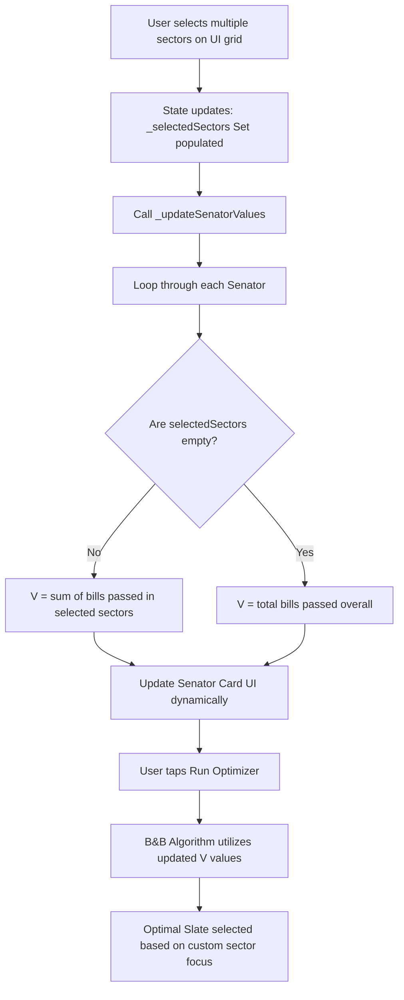

# Optivote-PH: Multi-Sector Selection Mechanics

This document explains the step-by-step logic, calculations, and code workflow when a user selects **more than one bill sector** (e.g., choosing both **Social Services** and **Education**) in the Optivote-PH application.

---

## 1. High-Level Flow Chart



---

## 2. Dynamic Value Recalculation ($V$)

A senator's productivity value ($V$) is dynamic. When a user selects multiple sectors, the value $V$ is calculated by summing the bill counts passed by that senator **only** in the selected sectors. 

### The Formula:
$$V = \sum_{s \in S} \text{SectorPassed}[s]$$

Where:
* $S$ is the set of user-selected sectors.
* $\text{SectorPassed}[s]$ is the number of bills the senator has passed in sector $s$.

---

## 3. Concrete Numerical Example

Let's trace what happens to **Senator Pia S. Cayetano**'s data when multiple sectors are selected.

### Historical Record in the Database:
* **Social Services & Human Development**: `103` bills passed
* **Education, Science & Culture**: `32` bills passed
* **Economy, Finance & Labor**: `39` bills passed
* **Total Bills Passed (All Sectors)**: `97` *(Note: database entries for sector breakdowns can exceed overall main bills passed counts due to cross-category indexing or co-sponsorship counting)*

---

### Scenario A: No Sectors Selected (Default)
The value $V$ defaults to the total bills passed:
$$V = \text{Passed} = 97$$

---

### Scenario B: "Social Services" Selected
The value $V$ becomes:
$$V = \text{Social Services Passed} = 103$$

---

### Scenario C: "Social Services" AND "Education" Selected
The value $V$ is aggregated:
$$V = \text{Social Services Passed} + \text{Education Passed}$$
$$V = 103 + 32 = 135$$

*Any bills passed in the unselected "Economy" category (39 bills) are ignored ($0$ value).*

---

## 4. Code Implementation

This mechanism is handled by the `_updateSenatorValues()` function in [main.dart](file:///c:/Users/lenovo/StudioProjects/optivote_ph_mobile_prototype/lib/main.dart):

```dart
void _updateSenatorValues() {
  if (_allSenators == null) return;
  for (var senator in _allSenators!) {
    if (_selectedSectors.isEmpty) {
      // Default: Use total passed bills
      senator.v = senator.passed.toDouble();
    } else {
      // Multi-sector: Sum only the selected sectors
      int sum = 0;
      for (var s in _selectedSectors) {
        sum += senator.sectorPassed[s] ?? 0;
      }
      senator.v = sum.toDouble();
    }
  }
}
```

---

## 5. Impact on the Optimization Engine

When multiple sectors are selected, the Senator's value ($V$) increases, which directly alters their **Value-to-Weight ratio** ($\frac{V}{W}$):

1. **Increased Priority**: A candidate who performs exceptionally well in *both* of the selected sectors will receive a high accumulated $V$, boosting their $\frac{V}{W}$ ratio.
2. **Greedy Sorting Order**: The optimizer sorts candidates by $\frac{V}{W}$ in descending order at the beginning of the algorithm:
   ```dart
   sorted.sort((a, b) => (b.v / b.w).compareTo(a.v / a.w));
   ```
   This ensures that candidates who align strongly with the user's multiple priorities are evaluated first, setting a higher bound and ensuring they are more likely to make it into the final recommended slate.
